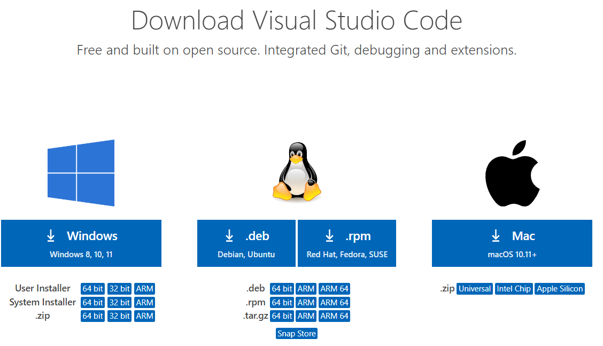
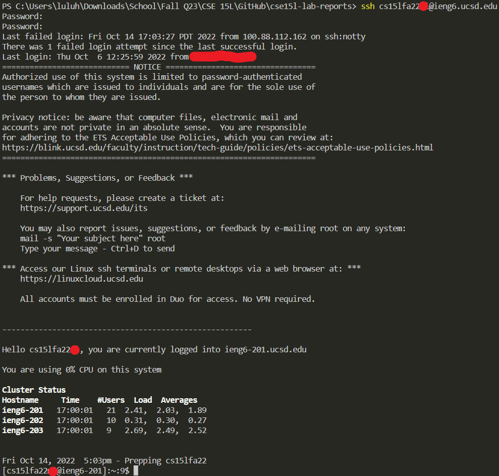
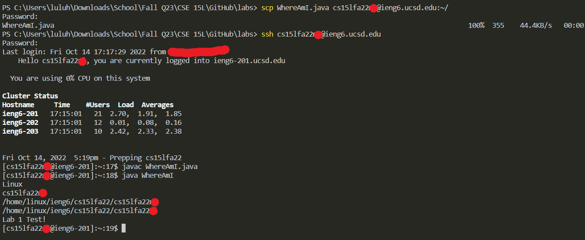

# Lab Report 2, Week 1
## Tutorial Introduction 
This is a tutorial on how to install VS code, connect remotely to another computer, move files with SCP, set an SSH key, and optimize remote running. 
> Although I was unable to login to my SSH account, I plan to update this lab report after I am able to get it working!
***

## Installing VS Code
Although I currently already have CS Code installed, I will still show how to download it. 
1. Head to the [VS Code](https://code.visualstudio.com/download) website. 
2. Click on whichever option is compatible with your computer (i.e. if you have a Windows operating system, click on the Windows installer).
 
3. Open the installer and follow the prompts given. 
4. After it's finished downloading, launch VS Code to make sure it's working.
***

## Remotely Connecting
Unfortunately, I was unable to get my SSH login working, although I did use a TA account in our lab session. However, I will still write down the steps to login.
1. Open the terminal in VS Code using the button "Terminal" on the top left of the application, or with the keyboard shortcut CTRL + `. 

2. Type `ssh cs15lfa22XX@ieng6.ucsd.edu` into the terminal, replacing XX with the two letters that are part of your personal CS account.
3. Once prompted, type in your password. Although there is no feedback, it will be recording your keystrokes. Once you're done, press enter. 
> If the password is wrong and/or denied for another reason, it will prompt you again afterwards. Unfortunately, this is what happened to my account so I was unable to have a screenshot of a successful login.
 

4. After entering your password correctly, it should pull up several lines of code before saying you have successfully logged in remotely.
***

## Trying Some Commands
Unfortunately, I cannot show any commands used while remotely connected, but some commands to try out are:
* cd ~
* cd (directory name)
* pwd 

***

## Moving Files With SCP
Again, I was unable to login to my SSH account, but I will still write the steps to move a file with SCP.
1. Type `scp (file name) cs15lfa22XX@ieng6.ucsd.edu:~/`, replacing XX with your personal account letters.
> Again, I was unable to get my account working so I cannot show the full process.

2. Once prompted, type in your SSH account password.
3. Lines of code will print afterwards, showing the progress of the file copying. The file has been successfully copied once it reaches 100%.
4. After that (to test if it worked), connect remotely using `ssh cs15lfa22XX@ieng6.ucsd.edu` and type in your password.
5. Compile the file you moved over and run it using the commands `javac (file name)` and `java (file name)`, the last one without the suffix.

## Setting an SSH Key
I was unable to login, I will update this part of the report as soon as I get my SSH login working. The general idea however, is to:

1. Type `ssh-keygen` into the terminal. Once prompted, save the passphrase into a folder on your computer, and then press enter again to set the default path.
> If your operating system is on Windows, there is an additional step to saving an ssh.
2. 