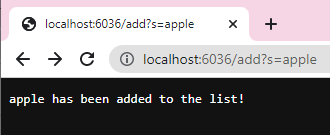
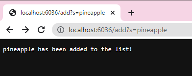
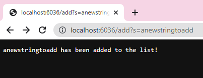
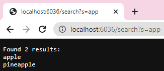
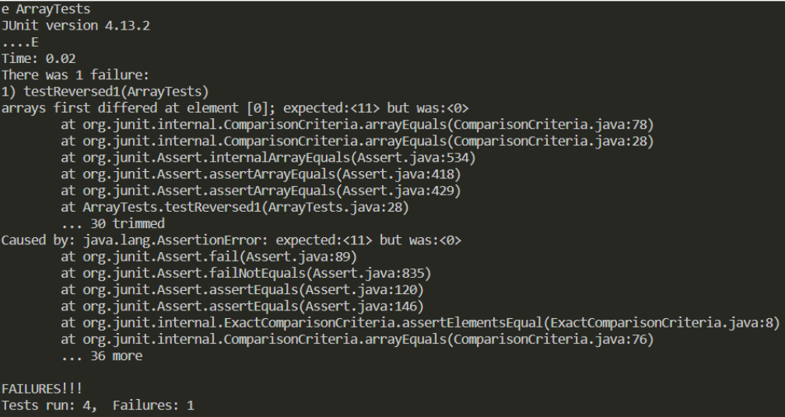
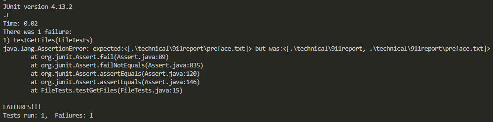

# Lab Report 2
## Introduction
This lab report focuses on creating a simple search engine using queries, as well as bug/symptom testing.


## Part I: Search Engine 
In regards to the search engine, the two queries we focused on were `/add` and `/search`, in which the former would add whatever element came afterwards into a list, and the latter would be able to pull up any element in the list that contained the string. 

If we ignore the packages imported, as well as everything else that did not relate to the functions of the search engine itself, the code is this:
```
class Handler implements URLHandler {
    ArrayList<String> listOfStrings = new ArrayList<String>();
    ArrayList<String> results = new ArrayList<String>();

    public String handleRequest(URI url) {
        if (url.getPath().equals("/search")) {
            String[] parameters = url.getQuery().split("=");
            if (parameters[0].equals("s")) {
                for (int i = 0; i < listOfStrings.size(); i++) {
                    if (listOfStrings.get(i).contains(parameters[1])) {
                        results.add(listOfStrings.get(i));
                        }
                    }
                String resultList = "";
                resultList = String.join("\n", results);
                return String.format("Found %d results:\n%s", results.size(), resultList); 
            }
            else {
                return "No element specified to search for!";
            }
        }
        if (url.getPath().equals("/add")) {
            System.out.println("Path: " + url.getPath());
            String[] parameters = url.getQuery().split("=");
            if (parameters[0].equals("s")) {
                listOfStrings.add(parameters[1]);
                return String.format(parameters[1] + " has been added to the list!");
            }
            return "No element specified to add!";
        }
        else {
            return "Simple Search Engine!";
        }
    }
}
```
This code goes through queries and adds elements to a separate list called `listOfStrings`, and then iterates through it to find any element that contains the desired string.


Some examples of the code being implemented are:







In the images above, "apple", "pineapple", and "anewstringtoadd" are being added to the `listOfStrings`. This calls several methods: 
* `.add(String e)` --> `listofStrings.add(parameters[1])`, in which everything after the equal sign (=) in the URL is being added to the `listOfStrings`.
* `.getPath()`
* `.getQuery()`
* `.split(String regex)` --> `url.getQuery().split("=")`, in which `String[] parameters` is assigned the query of the URL.
* `.equals(Object anObject)` --> `parameters[0].equals("s")`, in which the condition is met if the specified part of the URL contains the letter "s", and `url.getPath().equals("/add")` fulfills the condition if the URL path equals "/add".
* `.format(String format, Object... args)` --> `String.format(parameters[1] + " has been added to the list!")`, which prints out what element has been added to the list for confirmation in proper format.

None of these values change, as it is simply adding a string into an arraylist of strings. 



In this image, the desired search is "app", which results in "apple" and "pineapple", and not "anewstringtoadd" since it does not contain what was searched. It iterates through the `listOfStrings` to find which strings contain the parameter given. This also calls several methods: 
* `.add(String e)` --> `results.add(listOfStrings.get(i))`, in which everything that contains the parameter is added to a new arraylist for printing.
* `.getPath()`
* `.contains(CharSequence s)` --> `listOfStrings.get(i).contains(parameters[1])`, in which the condition is met if the URL contains the specified parameter.
* `.getQuery()`
* `.split(String regex)` --> `url.getQuery().split("=")`, in which `String[] parameters` is assigned the query of the URL.
* `.equals(Object anObject)` --> `parameters[0].equals("s")`, in which the condition is met if the specified part of the URL contains the letter "s". 
* `.format(String format, Object... args)` --> `String.format("Found %d results:\n%s", results.size(), resultList)`, which prints out how many elements and which have been found to contain the parameter. 
* `.join(CharSequence delimiter, Iterable <? extends CharSequence> elements)` --> `String.join("\n", results)`, in which resultList is assigned to this and now prints every element that fits the search in separate rows.

These values, similarly, do not change as they are strings being added to a singular string, only separated in lines.

***

## Part II: Bugs/Symptoms 
Although we focused on many different methods and tests, here are two examples of them: in the ArrayExamples.java file, `reversed(int[] arr)`; and in the FileExample.java file, `getFiles(File start)`. 

These two examples originally had buggy code, which caused them to fail tests that called these methods. I included the fixed code, as well as explanations as to why the original code was buggy and why it caused those particular symptoms.

> **THE `reversed(int[] arr)` METHOD**

This is the failure-inducing input:

```
static int[] reversed(int[] arr) {
    int[] newArray = new int[arr.length];
    for(int i = 0; i < arr.length; i += 1) {
      arr[i] = newArray[arr.length - i - 1];
    }
    return arr;
}
```

This is the test for the method:

```
@Test
public void testReversed1() {
    int[] input2 = { 8 , 9 , 10 , 11 };
    assertArrayEquals(new int[]{ 11 , 10 , 9 , 8 }, ArrayExamples.reversed(input2));
}
```

And these are the symptoms:



The fixed code is this:

```
static int[] reversed(int[] arr) {
    int[] newArray = new int[arr.length];
    for(int i = 0; i < arr.length; i += 1) {
      newArray[i] = arr[arr.length - i - 1];
    }
    return newArray;
}
```

The reason the original code was buggy was due to the fact that it was supposed to return a new array with reversed values, but actually was setting the original array's values to the new array, which did not have any values in the beginning. This caused the original array to have 0 as its value. It also returns the original array at the end when it should be returning the new array. 

As you can see, the expected value at the first element of the array was 11, but actually resulted in 0. This is what failed the test, as they are supposed to be equivalent. It does not make sense for the array to be 0 since we are simply reversing the array and not deleting any elements. 

> **THE `getFiles(File start)` METHOD**

This is the failure-inducing input:

```
static List<File> getFiles(File start) throws IOException {
	File f = start;
	List<File> result = new ArrayList<>();
	result.add(start);
	if(f.isDirectory()) {
        File[] paths = f.listFiles();
        for(File subFile: paths) {
            result.add(subFile);
        } 
	}
	return result;
}
```

This is the test for the method:

```
@Test 
public void testGetFiles() throws IOException {
    File allFiles = new File("./technical/911report");
    File expect = new File(".\\technical\\911report\\preface.txt");
    List<File> expected = new ArrayList<>();
    expected.add(expect);
    assertEquals(expected, FileExample.getFiles(allFiles));
}
```

And these are the symptoms:



The fixed code is this:

```
static List<File> getFiles(File start) throws IOException {
    File f = start;
    List<File> result = new ArrayList<>();
    if(f.isDirectory()) {
        File[] paths = f.listFiles();
        for(File subFile: paths) {
            result.addAll(getFiles(subFile));
        }
    }
    else {
        result.add(start);
    }
    return result;
}
```

The original code was buggy due to the fact that `getFiles` was only visiting one directory. Not only that, the `.add` outside of the `if` statement was causing the directory to be added to the list when it should only be adding files since there was no `if` condition limiting it. As you can see in the image with the symptoms, the code for `getFiles` was adding the directory `.\technical\911report\` to the list as well despite the fact that it should only be adding the file `.\technical\911report\preface.txt` to the list. Therefore, with all of this information, it was possible to fix the code. 


End.