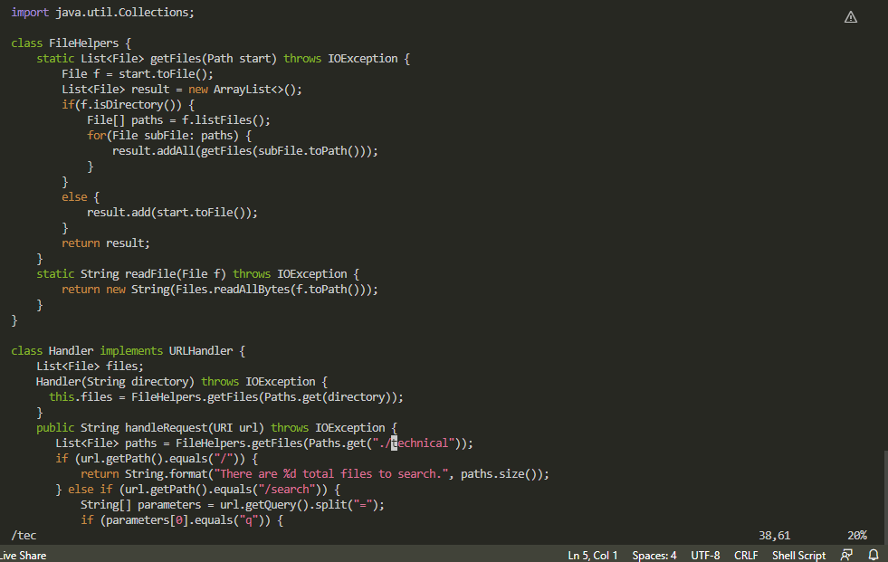
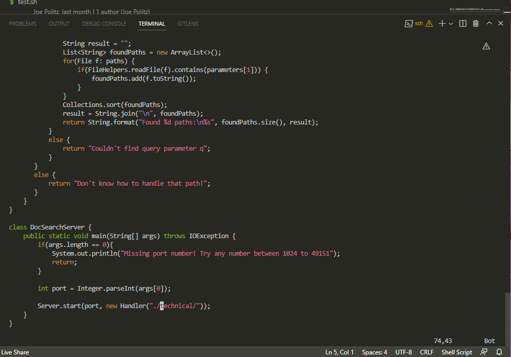
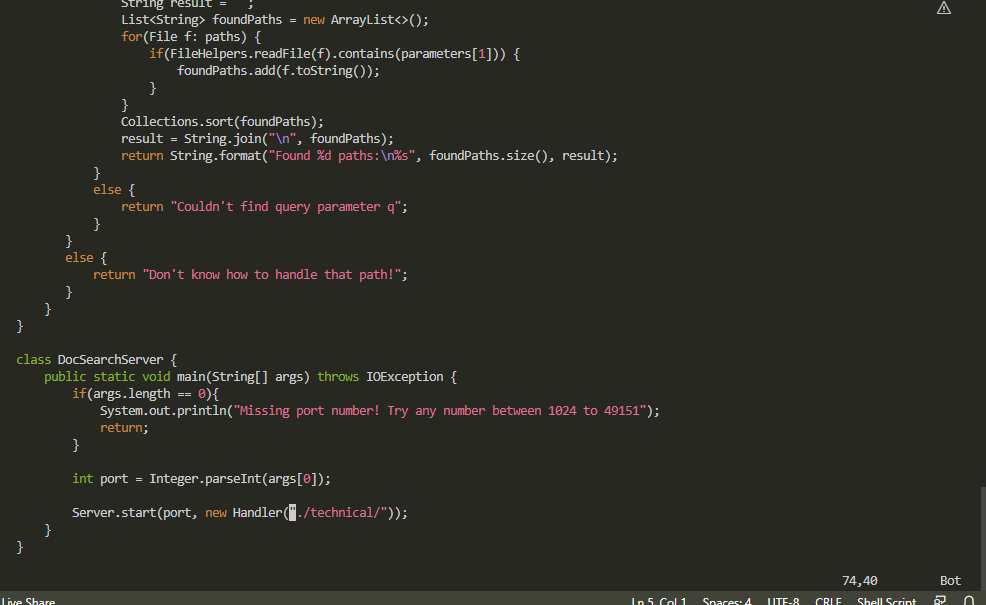
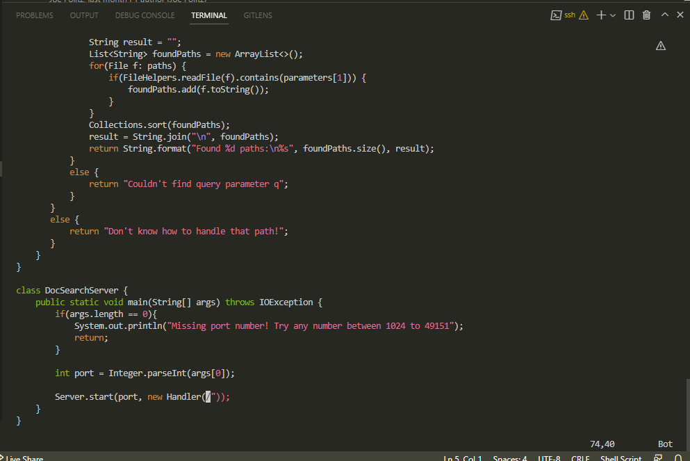
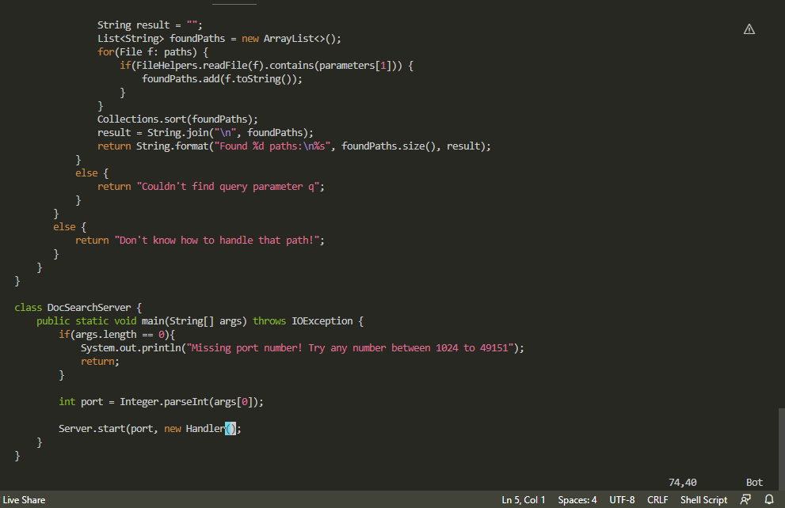
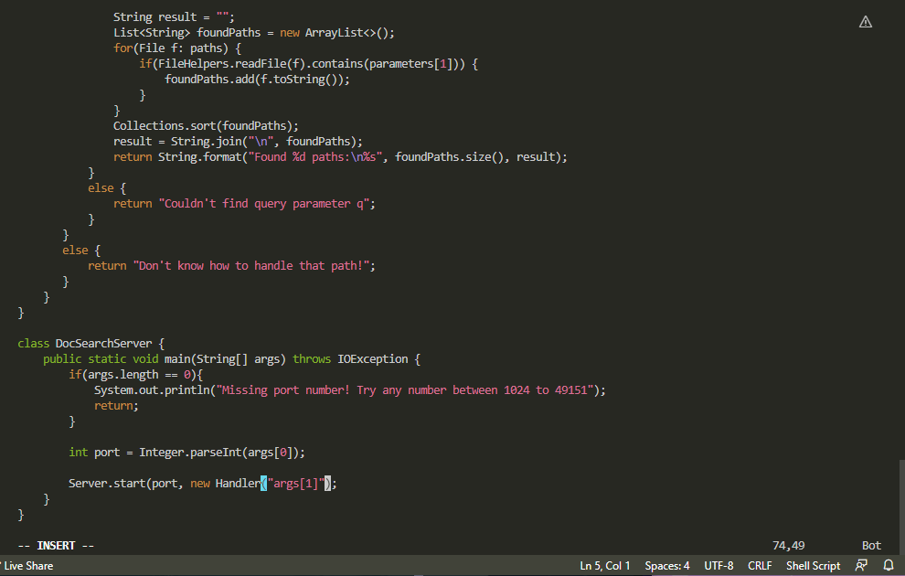
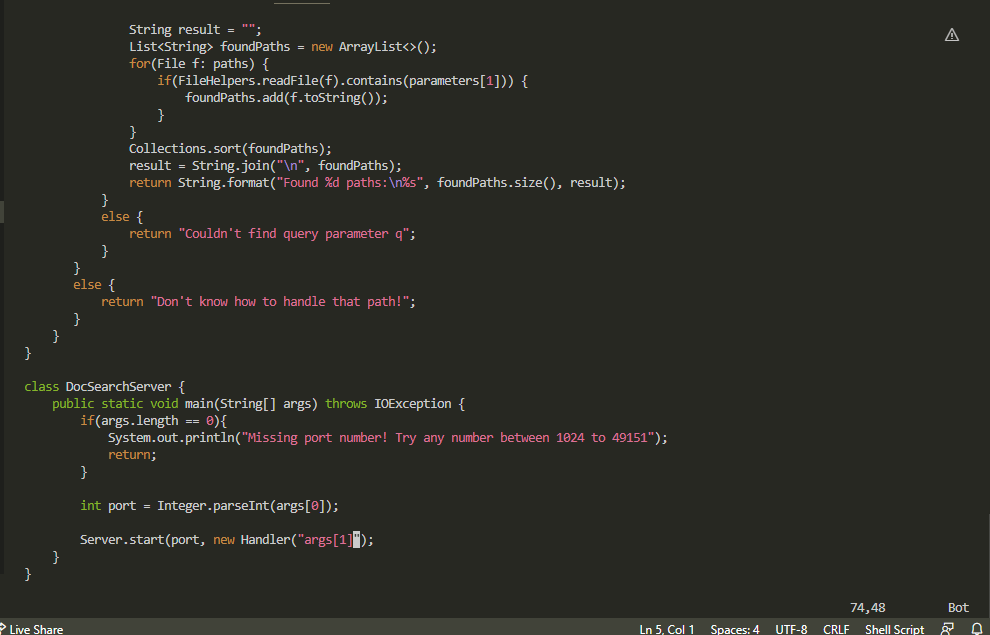
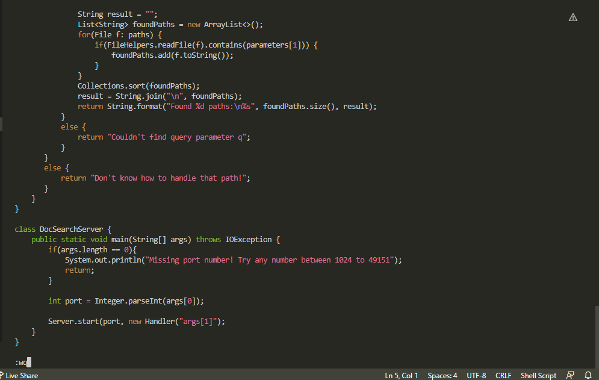
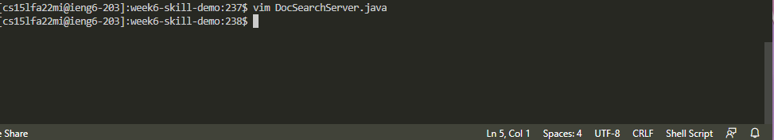

# Lab Report 4
## Introduction

In this lab report, we practiced using VIM and finding the shortest possible navigation/edit methods in files. We also compared the speed of using VIM vs. SCP'ing a file.

***

## Part I: Changing the `main` method to take a command-line argument

The keystrokes that our group came up with, in the shortest sequence, is this:
`/tec<Enter>n3hd2w3xi<Enter>"args[1]"<Esc>:wq<Enter>`
Which is 29 keystrokes total.

The behavior of the keystrokes are below:
`/tec<Enter>`
> 

`n`
> 

`3h`
> 

`d2w`
> 

`3x`
> 

`i<Enter>"args[1]"`
> 

`<Esc>`
> 

`:wq`
> 

`<Enter>`
> 

***

## Part II: Comparing VIM and SCP