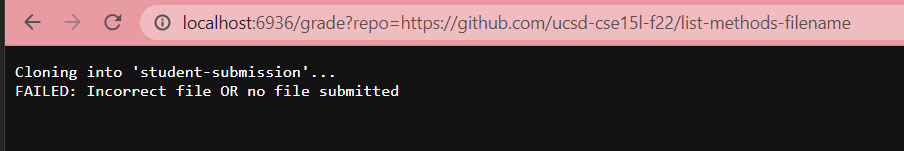
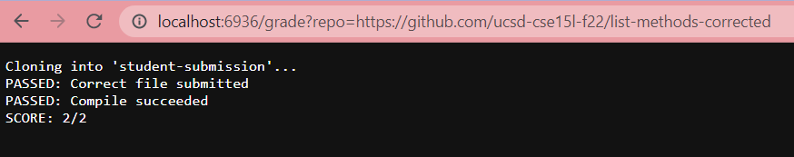
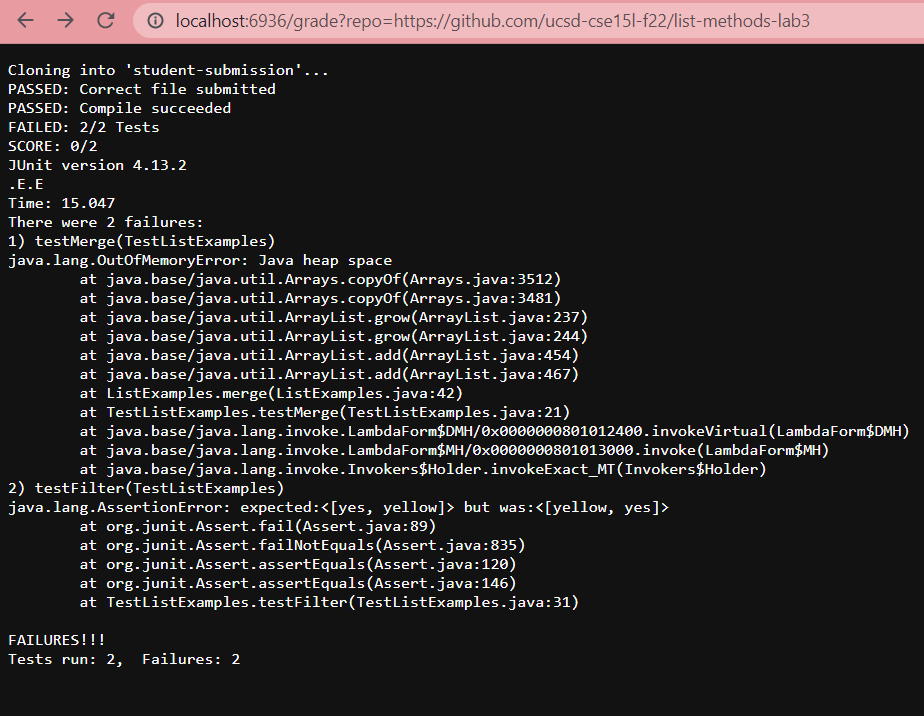

# Lab Report 5
## Introduction

In this lab report, we worked on autograding script. 

***

## `grade.sh`

This is the code to my autograding script in `grade.sh`. NOTE: This is **WINDOWS**-based, not Linux or Mac!

```
CPATH=".;../lib/hamcrest-core-1.3.jar;../lib/junit-4.13.2.jar"

rm -rf student-submission
git clone $1 student-submission
cp TestListExamples.java student-submission
cd student-submission

if [[ -f "ListExamples.java" ]]
then
    echo "PASSED: Correct file submitted"
else
    echo "FAILED: Incorrect file OR no file submitted"
    exit
fi

javac ListExamples.java 2> error.txt 

if [[ $? -eq 0 ]]
then
    javac -cp $CPATH *.java
    echo "PASSED: Compile succeeded"
else
    javac -cp $CPATH *.java 2> error.txt 
    echo "FAILED: Your program didn't compile"
    cat error.txt
    exit
fi

java -cp $CPATH org.junit.runner.JUnitCore TestListExamples > out-err.txt

if [[ $(grep -c "Failures: 1" out-err.txt) -ne 0 ]]
then
    let "error+=1"
    echo "FAILED: 1/2 Tests"
fi

if [[ $(grep -c "Failures: 2" out-err.txt) -ne 0 ]]
then
    let "error+=2"
    echo "FAILED: 2/2 Tests"
fi

if [[ $error -eq 2 ]]
then
    echo "SCORE: 0/2"
    cat out-err.txt
fi

if [[ $error -eq 1 ]]
then
    echo "SCORE: 1/2"
    cat out-err.txt
fi

if [[ $error -eq 0 ]]
then
    echo "SCORE: 2/2"
fi
```

## Examples

Below are three examples of this code being implemented through a web server.

1) 

2) 

3) 

The example I want to highlight is example 3, where the student submission fails both tests and results in a score of 0/2. By tracing, I will explain what the standard output and standard error are for each line with a command, as well as whether its return code was zero or nonzero. I will also state whether an `if` statement was true or false and why, as well as which lines do not run. The trace of this example is as so:

* The first 5 lines (not including line breaks) are relatively standard. These commands have a standard output of performing their commands. The return code currently is still zero.
* The next line `if [[ -f "ListExamples.java" ]]` results in true due to the student submission file being named correctly, thus echoing `"PASSED: Correct file submitted"` as the output. The `else` statement does not run due to the condition being met.
* The line `javac ListExamples.java 2> error.txt` runs properly with a standard output of compiling `ListExamples.java`. So far, the exit code is still zero.
* `if [[ $? -eq 0 ]]` runs and is successfully fulfilled due to the exit code being zero, and compiles all the files while outputting `"PASSED: Compile succeeded"`. The lines in the `else` statement do not run because the condition has been met. 
* `java -cp $CPATH org.junit.runner.JUnitCore TestListExamples > out-err.txt` runs properly with a standard output of running `TestListExamples` and piping it to a text file for later evaluation of scores. In this case, the exit code is now 1 due to the failures.
* The next two `if` statements contain `grep`. The first `if` statement checks if only one test has failed while the second checks if both failed. They do so by reading the error output and searching for the amount of failures. In this case, the first statement is not run due to the condition not being met and no `else` statement being stated, and is false. The second is run due to the condition being met, and thus increments the error counter by two.
* The next three `if` statements are focused on what is outputted based on the amount of errors. In this case, the last two statements are not run due to their condition not being met and are thus false, as the error counter is 2. `if [[ $error -eq 2 ]]` is run and is true, resulting in the given score `"SCORE: 0/2"` and the errors being printed out for the student to read. 


End.